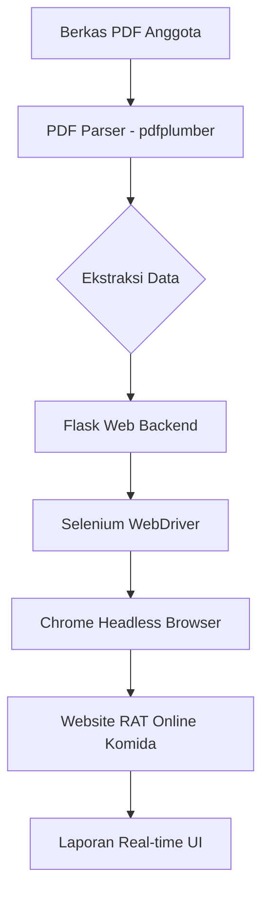

<div align="center">

# 🚀 RAT Online Form Automation

**Otomatisasi Cerdas untuk Pengisian Formulir RAT Online Komida**

[](https://www.python.org/)
[](https://www.selenium.dev/)
[](https://flask.palletsprojects.com/)
[](https://www.docker.com/)

---

[✨ Fitur Utama](#-fitur-utama) • [🛠️ Instalasi](#-instalasi) • [🚀 Cara Penggunaan](#-cara-penggunaan) • [📋 Format Data](#-format-data) • [👨‍💻 Pengembang](#-pengembang)

</div>

## 📖 Tentang Projek

**RAT Online Form Automation** adalah solusi otomatisasi berbasis Python yang dirancang untuk mempercepat proses pengisian formulir RAT Online secara masal. Dengan mengintegrasikan teknologi _Web Scraping_ (Selenium) dan _PDF Parsing_ yang cerdas, alat ini mampu memproses ratusan data anggota dalam waktu singkat dengan tingkat akurasi yang tinggi.

## ✨ Fitur Utama

- ⚡ **Turbo Speed Performance**: Dioptimalkan untuk memproses setiap anggota dalam **kurang dari 30 detik**.
- 📑 **Batch PDF Processing**: Mendukung unggahan hingga **10 file PDF** sekaligus.
- 🧠 **Smart PDF Extractor**: Algoritma cerdas yang mampu mengenali tabel di berbagai halaman tanpa terganggu oleh header tabel yang berulang.
- 🖼️ **Resource Optimization**: Mematikan pemuatan gambar (_Image Suppression_) dan berjalan dalam mode latar belakang (_Headless_) untuk penghematan bandwidth dan RAM.
- 🕒 **Live Dashboard**: Pantau progres keberhasilan, kegagalan, dan durasi proses secara real-time.
- 🛑 **Control Center**: Dilengkapi fitur **Batal (Cancel)** untuk menghentikan proses secara instan jika terjadi kesalahan.
- 🔄 **Auto-Skip Logic**: Secara cerdas melewati anggota yang sudah pernah mengisi formulir untuk menghindari duplikasi data.

## 🛠️ Instalasi

Pastikan Anda memiliki **Python 3.8** atau versi yang lebih baru terpasang di sistem Anda.

1. **Clone Repositori**:

   ```bash
   git clone https://github.com/rikiteguhmaulana/rat-online-automation.git
   cd rat-online-automation
   ```

2. **Pasang Dependensi**:
   ```bash
   pip install -r requirements.txt
   ```

## 🚀 Cara Penggunaan

### Opsi 1: Melalui Antarmuka Web (UI) - _Direkomendasikan_

Metode ini paling mudah digunakan karena menyediakan tampilan visual dan manajemen file yang lebih baik.

```bash
python app.py
```

Akses melalui browser di: `http://localhost:5000`

### Opsi 2: Melalui Command Line (CLI)

Cocok untuk penggunaan teknis atau skrip otomatisasi tingkat lanjut.

```bash
python rat_automation.py "path/ke/berkas_anda.pdf"
```

---

## 🏗️ Arsitektur & Teknologi



- **Backend**: Python, Flask
- **Otomatisasi**: Selenium, WebDriver Manager
- **Parsing Data**: pdfplumber
- **Frontend**: Vanilla JS, HTML5, CSS3 (Modern UI)
- **Deployment**: Docker, Hugging Face Spaces

## 📋 Format Berkas PDF

Berkas PDF harus memiliki tabel yang mengandung kolom **Username** dan **Password**. Skrip ini sangat toleran terhadap format tabel yang kompleks atau terpotong halaman.

| No  | Nama      | Username  | Password |
| --- | --------- | --------- | -------- |
| 1   | Anggota A | 123456789 | abcd1    |
| 2   | Anggota B | 987654321 | wxyz2    |

## ☁️ Hosting & Akses Mobile

Projek ini dapat di-deploy ke **Hugging Face Spaces** menggunakan Docker, memungkinkan Anda menjalankan otomatisasi langsung dari HP tanpa membebani perangkat Anda.

- **Live Demo**: [Klik di Sini](https://rikitm10-rat-automation.hf.space/)

---

## 👨‍💻 Pengembang

Dibuat oleh **Riki Teguh Maulana**.

- 🌐 **GitHub**: [@rikiteguhmaulana](https://github.com/rikiteguhmaulana)
- 📸 **Instagram**: [@rikiitm\_](https://www.instagram.com/rikiitm_/)
- 📧 **Kontak**: [rikiteguh.dev@gmail.com]

---

<div align="center">

_Dibuat untuk memudahkan efisiensi penginputan data RAT Online secara masal dan akurat (2026)._

</div>
