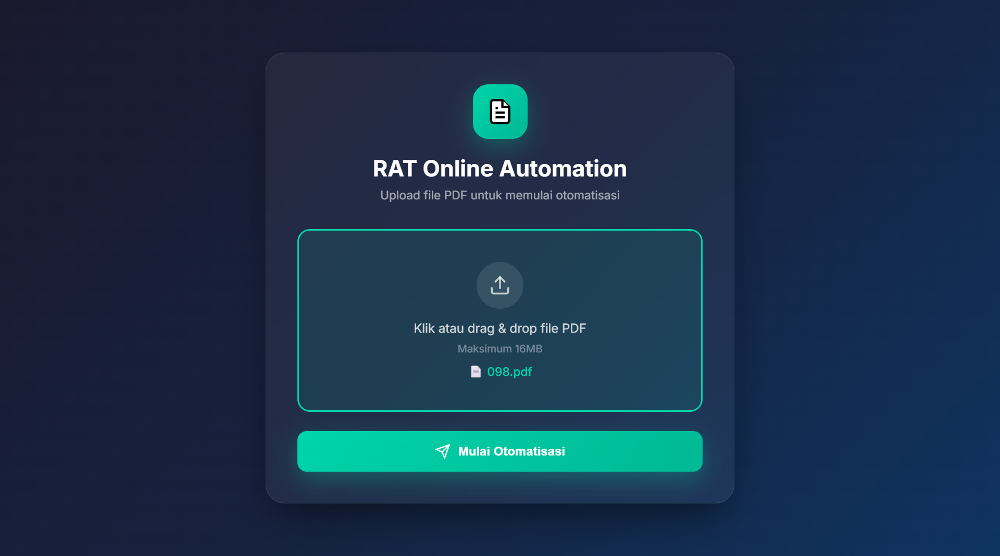
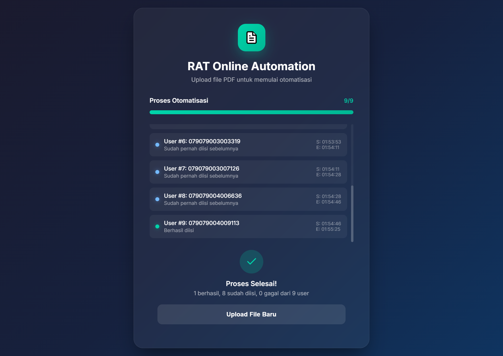

---
title: RAT Online Automation
emoji: 🚀
colorFrom: green
colorTo: indigo
sdk: docker
app_file: app.py
pinned: false
---

# 🚀 RAT Online Form Automation

Script Python untuk mengotomatisasi pengisian formulir web "RAT Online" dengan performa tinggi, ekstraksi data cerdas dari PDF, dan antarmuka web modern.

## ✨ Fitur Unggulan

- ⚡ **Turbo Speed**: Dioptimalkan untuk memproses setiap user dalam **kurang dari 30 detik**.
- 📑 **Multi-File Upload**: Mendukung upload hingga **10 file PDF** sekaligus.
- 🧠 **Smart PDF Parser**: Mendukung tabel multi-halaman tanpa gangguan header berulang.
- 👻 **Headless Mode**: Berjalan di background dengan konsumsi resource rendah (Chrome Headless).
- 🖼️ **Image Suppression**: Loading website jauh lebih cepat dengan mematikan pemuatan gambar.
- 🕒 **Live Tracking**: Pantau statistik keberhasilan secara real-time disertai waktu **Mulai (S)** dan **Selesai (E)** untuk setiap user.
- 🛑 **Process Cancellation**: Batalkan otomatisasi kapan pun jika terjadi kesalahan data.
- 🔄 **Auto-Skip**: Mendeteksi dan melewati user yang sudah pernah mengisi formulir sebelumnya.

## 🛠️ Instalasi

1. Pastikan Python 3.8+ sudah terinstall.
2. Clone repository dan masuk ke direktori project.
3. Install dependensi:
   ```bash
   pip install -r requirements.txt
   ```

## 🚀 Penggunaan

### Opsi 1: Web Interface (Sangat Direkomendasikan)

Menyediakan antarmuka grafis yang memudahkan pemantauan dan upload file massal.

```bash
python app.py
```

Akses di browser: `http://localhost:5000`

### Opsi 2: Command Line Interface

Cocok untuk penggunaan teknis atau scripting.

```bash
python rat_automation.py "path/ke/file.pdf"
```

### ☁️ Hosting di Hugging Face (Akses via HP)

Anda bisa menghosting project ini di **Hugging Face Spaces** agar bisa diakses dari mana saja (termasuk HP):

1. Buat Space baru di Hugging Face.
2. Pilih SDK: **Docker**.
3. Upload semua file project (termasuk `Dockerfile` yang sudah saya buatkan).
4. Setelah build selesai, Anda akan mendapatkan URL publik.
5. **Akses via HP**: Buka URL tersebut di **Google Chrome, Safari (iPhone), atau browser apa pun**. UI akan bekerja sempurna dan otomatisasi akan berjalan di server Hugging Face (bukan di browser HP Anda).

## 📋 Format PDF yang Didukung

File PDF harus berisi tabel dengan kolom **Username** dan **Password**. Script ini sangat toleran terhadap format tabel yang kompleks atau terpotong halaman.

| Nama | ... | Username        | Password |
| ---- | --- | --------------- | -------- |
| Eti  | ... | 079079001000642 | 204ce    |

## Nilai Hardcode (Saran & Masukan)

Script akan mengisi kolom berikut secara otomatis:

| Kriteria             | Nilai   |
| -------------------- | ------- |
| Pelayanan ke Anggota | baik    |
| Produk Pinjaman      | banyak  |
| Jumlah Pinjaman      | banyak  |
| Simpanan             | banyak  |
| Margin               | sedikit |
| Lain-lain            | cukup   |

## Konfigurasi

Edit variabel di awal file `rat_automation.py`:

- `SARAN_MASUKAN`: Nilai default untuk bagian saran.
- `TARGET_URL`: "https://komida.co.id/ratonline/"
- `WAIT_BETWEEN_USERS`: Delay antar user (Default: 0 untuk kecepatan maksimal).

## 🛡️ Catatan Keamanan & Performa

- Script menggunakan Chrome WebDriver yang dikelola secara otomatis oleh `webdriver-manager`.
- Performa kecepatan sangat bergantung pada stabilitas koneksi internet dan responsivitas server tujuan.
- Gunakan fitur **Batalkan** di Web UI jika Anda merasa ada kesalahan konfigurasi saat proses sedang berjalan.

## 👨‍💻 Developer

Project ini didevelop dan dikelola oleh **Riki Teguh Maulana**.

- 🌐 **GitHub**: [rikiteguhmaulana](https://github.com/rikiteguhmaulana)
- 📸 **Instagram**: [@rikiitm\_](https://www.instagram.com/rikiitm_/)

---

_Dibuat untuk memudahkan efisiensi penginputan data RAT Online secara masal dan akurat oleh Riki Teguh Maulana (2026)._

- Live Demo : https://rat-online-automation.hf.space/

- Tampilan Utama
  

- Tampilan Saat Proses
  
=======
---
title: RAT Online Automation
emoji: 🚀
colorFrom: green
colorTo: indigo
sdk: docker
app_file: app.py
pinned: false
---

# 🚀 RAT Online Form Automation

Script Python untuk mengotomatisasi pengisian formulir web "RAT Online" dengan performa tinggi, ekstraksi data cerdas dari PDF, dan antarmuka web modern.

## ✨ Fitur Unggulan

- ⚡ **Turbo Speed**: Dioptimalkan untuk memproses setiap user dalam **kurang dari 30 detik**.
- 📑 **Multi-File Upload**: Mendukung upload hingga **10 file PDF** sekaligus.
- 🧠 **Smart PDF Parser**: Mendukung tabel multi-halaman tanpa gangguan header berulang.
- 👻 **Headless Mode**: Berjalan di background dengan konsumsi resource rendah (Chrome Headless).
- 🖼️ **Image Suppression**: Loading website jauh lebih cepat dengan mematikan pemuatan gambar.
- 🕒 **Live Tracking**: Pantau statistik keberhasilan secara real-time disertai waktu **Mulai (S)** dan **Selesai (E)** untuk setiap user.
- 🛑 **Process Cancellation**: Batalkan otomatisasi kapan pun jika terjadi kesalahan data.
- 🔄 **Auto-Skip**: Mendeteksi dan melewati user yang sudah pernah mengisi formulir sebelumnya.

## 🛠️ Instalasi

1. Pastikan Python 3.8+ sudah terinstall.
2. Clone repository dan masuk ke direktori project.
3. Install dependensi:
   ```bash
   pip install -r requirements.txt
   ```

## 🚀 Penggunaan

### Opsi 1: Web Interface (Sangat Direkomendasikan)

Menyediakan antarmuka grafis yang memudahkan pemantauan dan upload file massal.

```bash
python app.py
```

Akses di browser: `http://localhost:5000`

### Opsi 2: Command Line Interface

Cocok untuk penggunaan teknis atau scripting.

```bash
python rat_automation.py "path/ke/file.pdf"
```

### ☁️ Hosting di Hugging Face (Akses via HP)

Anda bisa menghosting project ini di **Hugging Face Spaces** agar bisa diakses dari mana saja (termasuk HP):

1. Buat Space baru di Hugging Face.
2. Pilih SDK: **Docker**.
3. Upload semua file project (termasuk `Dockerfile` yang sudah saya buatkan).
4. Setelah build selesai, Anda akan mendapatkan URL publik.
5. **Akses via HP**: Buka URL tersebut di **Google Chrome, Safari (iPhone), atau browser apa pun**. UI akan bekerja sempurna dan otomatisasi akan berjalan di server Hugging Face (bukan di browser HP Anda).

## 📋 Format PDF yang Didukung

File PDF harus berisi tabel dengan kolom **Username** dan **Password**. Script ini sangat toleran terhadap format tabel yang kompleks atau terpotong halaman.

| Nama | ... | Username        | Password |
| ---- | --- | --------------- | -------- |
| Eti  | ... | 079079001000642 | 204ce    |

## Nilai Hardcode (Saran & Masukan)

Script akan mengisi kolom berikut secara otomatis:

| Kriteria             | Nilai   |
| -------------------- | ------- |
| Pelayanan ke Anggota | baik    |
| Produk Pinjaman      | banyak  |
| Jumlah Pinjaman      | banyak  |
| Simpanan             | banyak  |
| Margin               | sedikit |
| Lain-lain            | cukup   |

## Konfigurasi

Edit variabel di awal file `rat_automation.py`:

- `SARAN_MASUKAN`: Nilai default untuk bagian saran.
- `TARGET_URL`: "https://komida.co.id/ratonline/"
- `WAIT_BETWEEN_USERS`: Delay antar user (Default: 0 untuk kecepatan maksimal).

## 🛡️ Catatan Keamanan & Performa

- Script menggunakan Chrome WebDriver yang dikelola secara otomatis oleh `webdriver-manager`.
- Performa kecepatan sangat bergantung pada stabilitas koneksi internet dan responsivitas server tujuan.
- Gunakan fitur **Batalkan** di Web UI jika Anda merasa ada kesalahan konfigurasi saat proses sedang berjalan.

## 👨‍💻 Developer

Project ini didevelop dan dikelola oleh **Riki Teguh Maulana**.

- 🌐 **GitHub**: [rikiteguhmaulana](https://github.com/rikiteguhmaulana)
- 📸 **Instagram**: [@rikiitm\_](https://www.instagram.com/rikiitm_/)

---

_Dibuat untuk memudahkan efisiensi penginputan data RAT Online secara masal dan akurat oleh Riki Teguh Maulana (2026)._

- Live Demo : [https://rikitm10-rat-automation.hf.space/)

## Tampilan Utama
  
  
## Tampilan Saat Proses
  

